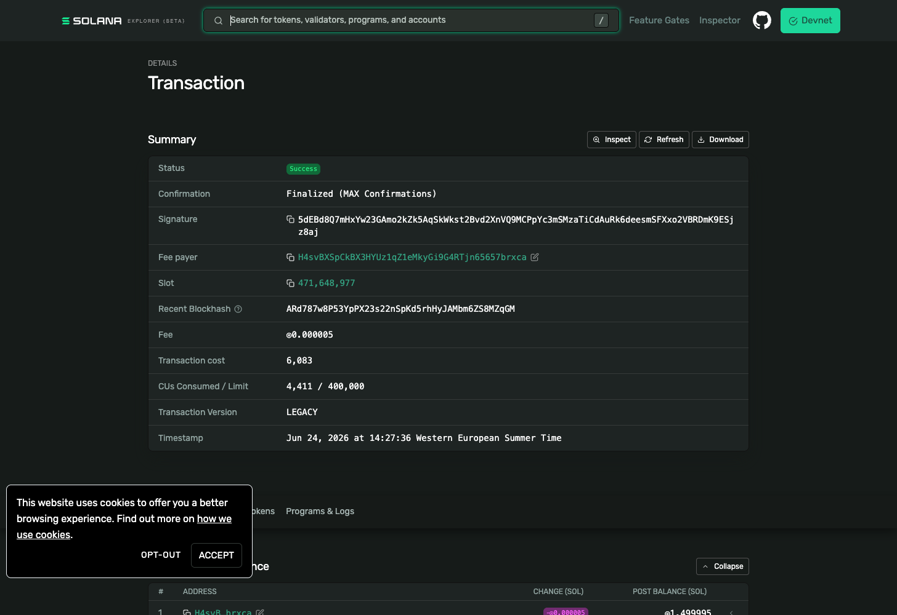
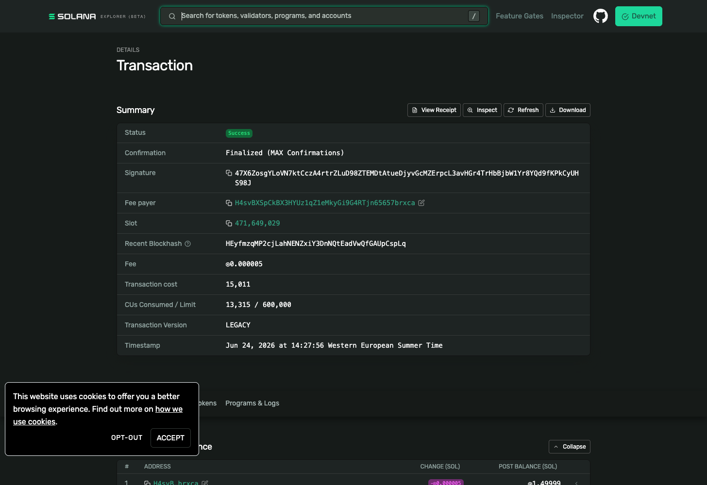

# Ad marketplace — on-chain devnet proof

Every transaction type the ad marketplace produces, executed and **verified by the
server** on Solana **devnet**, via `scripts/ad_devnet_shakeout.mjs` (funded by
`SOLANA_DEVNET_DEPLOYER`). 7/7 checks passed.

- **Cluster:** devnet
- **USDC test mint:** `GLHXdgapQfjM8BjXKfByXjev5Dov8ev3gFAACrBhuAhW`
- **WOC test mint:** `GYtciy7HEtrqBBD37TPQNAw1S7wGEDdUcw9YSTmGsV81`
- **Keeper / treasury:** `H4svBXSpCkBX3HYUz1qZ1eMkyGi9G4RTjn65657brxca`
- **Buyer (advertiser):** `9oFjX87Bs4j6fu3H1UHxuKcbcwKssQpPsq6BGZFMnyhf`

| # | Transaction | What it proves | Solscan (devnet) |
|---|---|---|---|
| 1 | **WOC pay** | SPL `TransferChecked`, buyer → treasury, 200 WOC; server verified + booking → `pending_review` | [tx](https://solscan.io/tx/2DaZ4cP77h5xyCtk6tM4UhReB3mvQPKmJaCTEbqZr6iEhSbBX5KMS1x1ySMKuQ2wJWPGAKtMRzEounTfjW48uwbL?cluster=devnet) |
| 2 | **WOC deferred burn** | SPL `BurnChecked` of exactly 50% (100 WOC) by the treasury, on admin approval | [tx](https://solscan.io/tx/5dEBd8Q7mHxYw23GAmo2kZk5AqSkWkst2Bvd2XnVQ9MCPpYc3mSMzaTiCdAuRk6deesmSFXxo2VBRDmK9ESjz8aj?cluster=devnet) |
| 3 | **USDC pay** | SPL `TransferChecked`, buyer → treasury, 2 USDC; server verified | [tx](https://solscan.io/tx/bQDrtxgxkLQosSXVKAjqjdcRrMVESU3HhtCrTh62Da9sR64htP9wrARniqMs5k66rN8FcHDpu1nRBDAzMhTRH9S?cluster=devnet) |
| 4 | **USDC refund** | SPL `TransferChecked`, treasury → buyer, full price, on admin reject | [tx](https://solscan.io/tx/47X6ZosgYLoVN7ktCczA4rtrZLuD98ZTEMDtAtueDjyvGcMZErpcL3avHGr4TrHbBjbW1Yr8YQd9fKPkCyUHS98J?cluster=devnet) |
| 5 | **SOL pay** | native `System Program` transfer, buyer → treasury, 0.02 SOL; proves the **lamport-delta verifier** | [tx](https://solscan.io/tx/34qqArCkqrmF3E8A9F9gucAn9xMrgGfDDadV6wn3TdpyU9kyyogFzM88KfqZNa49Pdm9sXGn4T2jy9FVoWkwEz7U?cluster=devnet) |
| 6 | **SOL refund** | native `System Program` transfer, treasury → buyer, on admin reject | [tx](https://solscan.io/tx/2bqurD2UPBKooe4KcXCwKEzWPdDs9i973DFUWi16sx4UVYMbxZQoQKzWDaq89YvnMF66BHG8BtXoeDV8WBAgSzzf?cluster=devnet) |

Plus: a replayed/bogus `/confirm` was rejected (the `tx_sig`/quote single-settlement guard).

## Screenshots

Captured from the official **Solana Explorer** (`scripts/capture_solscan_proof.mjs`) —
Solscan blocks automated browsers, but each screenshot is the **same on-chain
transaction** as its Solscan link above (identical signature). Every one shows
**Status: Success · Confirmation: Finalized (MAX Confirmations)** on **Devnet**.

### 1 — WOC pay (SPL transfer, buyer → treasury, 200 WOC)

### 2 — WOC deferred burn (BurnChecked, 50% = 100 WOC, by treasury)

### 3 — USDC pay (SPL transfer, 2 USDC)

### 4 — USDC refund (treasury → buyer)

### 5 — SOL pay (native System Program transfer, 0.02 SOL)

### 6 — SOL refund (native System Program transfer, treasury → buyer)

